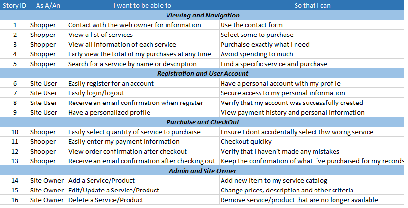
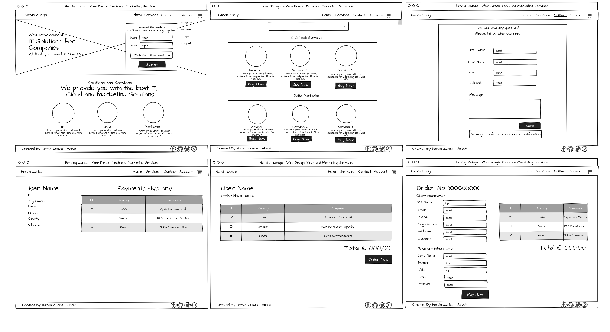

# HarvinZuniga Web Page

This project was thinked to be my personal web page to offer IT, Cloud and Marketing service. It is still under construcction and some features won´t be availables right now. The project is strongly based on the Boutique ADO MiniProject so a whole part of the code will be similar or even the same.

Follow this link to [my Personal Page](https://harvinzuniga.herokuapp.com/)

## UX

User Stories:

  
### Design

The site has been designed following Mobile First philosophy, also a clean design that alolow user to get focused in the information:

  * Has a responsive navigation menu 
  * Has a title in each page that let user know what page is reading
  * Uses URL containing page title 
  * Uses a clean theme that allow user to get focused in what they are looking for
  
  
  
## Features
### Existing Features

  * Cookie session that allow user to see his own reviews
  * Cookie session that allow user to login or logout
  * Checkout with stripe payment
  * Search field in services page.
  
### Features Left

  * Password validation in registration form.
  * Deploy CTA form
  * Enable Particles JS effect in landingpage
  * Contact form to send feedback.
  * User Profile page where the user can edit his information.
  * User profile page where the user can track his order status with a tracking bar.
  * Send email/sms notification when the order status change.
  * Integrate WhatsApp API comunication.
  * Enable 
  
## Used Technologies
This site was developed using the following technologies:

* [HTML5](https://en.wikipedia.org/wiki/HTML) 
   * As markup language for web design.
 * [CSS3](https://en.wikipedia.org/wiki/Cascading_Style_Sheets)
   * As style sheet laguage, used for describing the website style and presentation.
 * [Bootstrap 4](https://getbootstrap.com/)
   * For quicky design and customize as responsive mobile-first website.
 * [JavaScript](https://developer.mozilla.org/en-US/docs/Web/JavaScript)
   * For give functionallity and make it user-interactive.
 * [jQuery] (https://jquery.com/)
   * As javascript library for html document manipulation and event handling.
 * [Heroku] (https://heroku.com)
   * As hosting service with a Python enviroment.
 * [GIT](https://git-scm.com/)
   * As version control system.
 * [GitHub] (https://github.com)
   * For hosting repository.
 * [GitPod] (https://gitpod.com)
   *  As online IDE.

## Deployment

The project was deployed using Heroku , the [URL](https://harvinzuniga.herokuapp.com/) is automatic generated by Heroku and local deployment was not necesary in this case.

### How do I hosted the website

  * Create an account in Heroku
  * Create a new project
  * Specify configuration for Python enviroment (even in Heroku as in the reposotory)
  * Insert enviroment variables
  * Connect with GitHub Account
  * Activate Autodeployment function

### How to locally set the project

Will be Necesary to use the Code Institute Template and a GitPod Accoount
  * Make a fork of this reposiroty
  * Create an account in GitPod
  * Install GitPod Extension in your browser
  * Once installed gitpoed extension open GitHub and go to the forked repository
  * Click in the "green gitpod" button
  * Enjoy!

## Credits

This Project is inspired on Code Institute Project idea

### Acknowledgment

I would like to acknowledge to the following persons:

  * God, my father. He give me the inspiration and the ability to do this.
  * Diego, my little son. He is my motivation and my strength.
  * Irlanda, my wife. She took care of everything so I could focus on the project.
